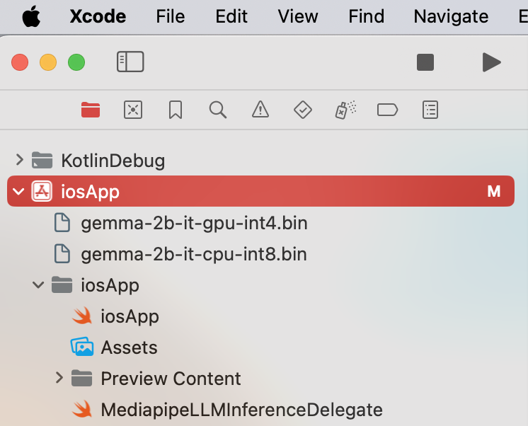
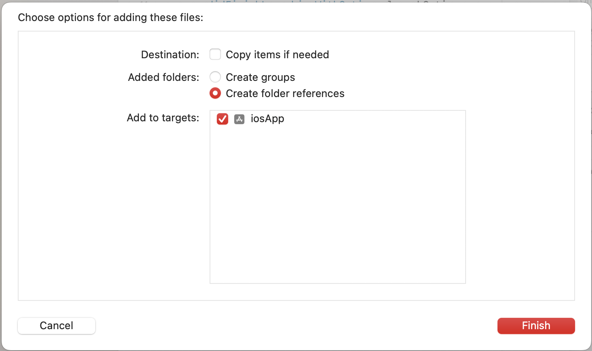
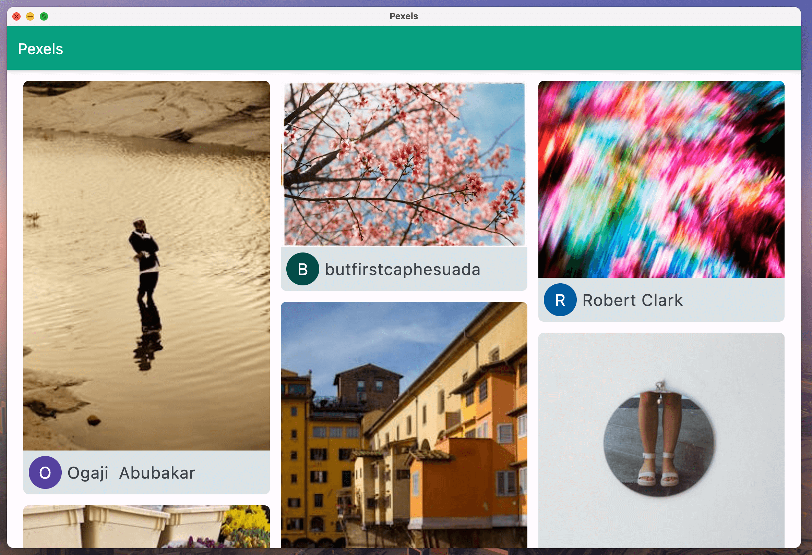
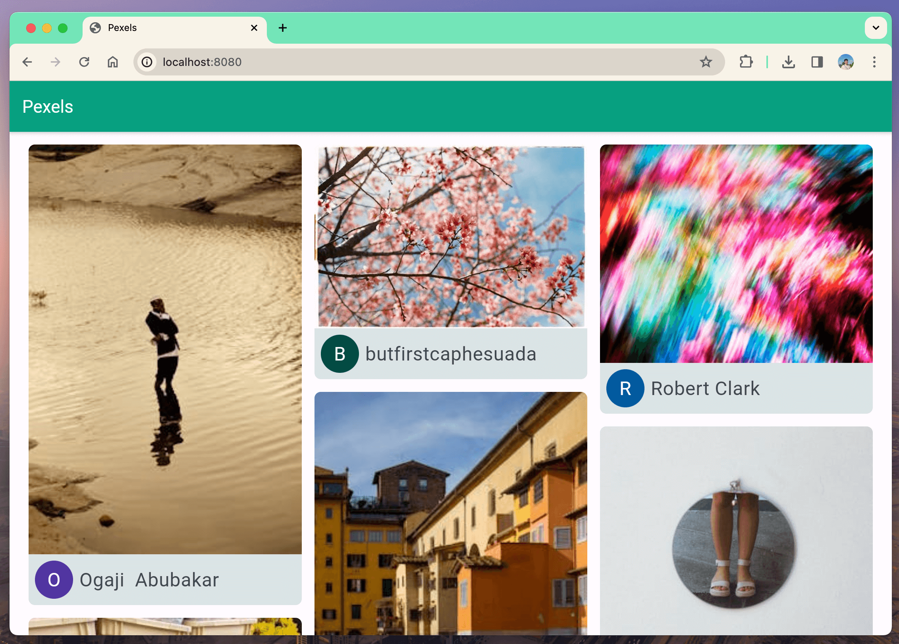
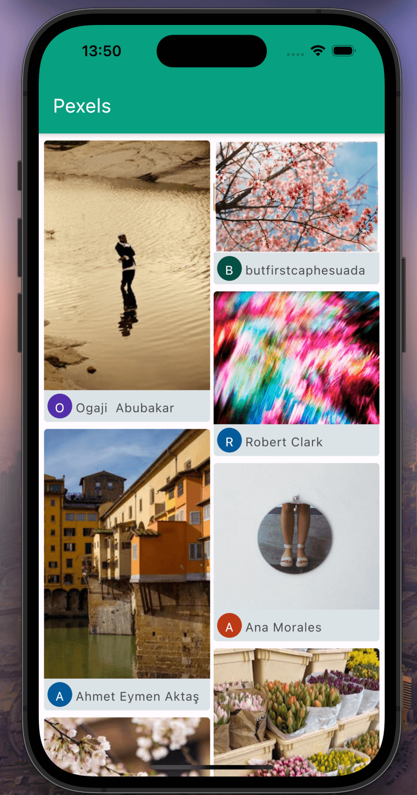
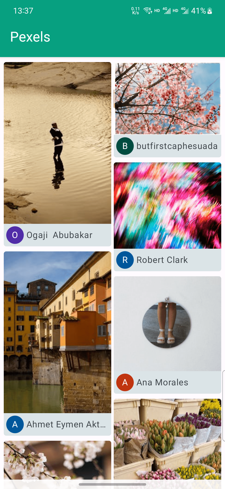

# Pexels and AI Sample App with KMP

This repo is dedicated to showcase the KMP usage with on-device model and GEN AI. It forked the Pexels as a template to demonstrate the basic KMP workflow and then link to a new AI chat screen to demonstrate the on-device model capability.

It's the sample project for my speech on Google I/O Extended XiaMen and GuangZhou 2024. 

Take below steps to set up the repo:

1. Follow the original Pexels's README to setup the KMP dependencies including JDK 17, Android Studio (with Android SDK), XCode (with iOS SDK) and Cocoapods. 
2. Download 2 models, [gemma-1.1-2b-it-gpu-int4](https://www.kaggle.com/models/google/gemma/tfLite/gemma-1.1-2b-it-gpu-int4) and [gemma-1.1-2b-it-cpu-int8](https://www.kaggle.com/models/google/gemma/tfLite/gemma-1.1-2b-it-cpu-int8), from Kaggle respectively.
3. Execute below command to push models to Android device respectively (must be physical device) ```adb push /the/path/to/gemma-2b-it-gpu-int4.bin data/local/tmp/llm/```
4. Move models to iOS project respectively (drag the model to the "iosApp" target and select "copy reference")
5. You can run the Android target just like normal application, and iOS target within the Android Studio via Kotlin Multiplatform IDE Plugin or the XCode running button. The sample enables Android and iOS only since the llm inference of mediapipe is only available on Android/iOS/Web, you can implement the web version by yourself.




# Pexels
A multiplatform client for [Pexels](https://www.pexels.com/) photos, powered by [Compose Multiplatform](https://www.jetbrains.com/lp/compose-multiplatform/)

## Supported Platforms

| Platform                       | Supported | Screenshot                                         |
|--------------------------------|-----------|----------------------------------------------------|
| Desktop(Linux, Windows, macOS) | ✅         |  |
| Web                            | ✅         |      |
| iOS                            | ✅         |      |
| Android                        | ✅         |  |

You can download prebuilt app file [here](https://github.com/linroid/Pexels/releases/tag/v1.0.0)

Web version: https://linroid.github.io/Pexels/

## Features
 - Pagination
 - Pull to refresh
 - Adaptive UI
 - Photo zoom in and zoom out
 - Transition
 - Cached photo list data

## Used Libraries
 - [ktor](https://ktor.io/): A multiplatform asynchronous HTTP client, which allows you to make requests and handle responses.
 - [kotlinx.serialization](https://github.com/Kotlin/kotlinx.serialization): A multiplatform JSON serialization library.
 - [koin](https://github.com/InsertKoinIO/koin): A pragmatic lightweight dependency injection framework for Kotlin & Kotlin Multiplatform.
 - [Voyager](https://github.com/adrielcafe/voyager): A pragmatic navigation library for Compose.
 - [Build Config](https://github.com/gmazzo/gradle-buildconfig-plugin): A plugin for generating BuildConstants.
 - [KStore](https://github.com/xxfast/KStore): A tiny Kotlin multiplatform library that assists in saving and restoring objects to and from disk.
 - [Napier](https://github.com/AAkira/Napier): A logger library for Kotlin Multiplatform.
 - [coil](https://github.com/coil-kt/coil): Image loading for Compose Multiplatform.

## Unit Tests
[](https://github.com/linroid/Pexels/actions/workflows/test.yml)
 - `PexelsApiTest`
 - `ObjectStoreTest`

## Before running!
 - check your system with [KDoctor](https://github.com/Kotlin/kdoctor)
 - install JDK 17 or higher on your machine
 - add `local.properties` file to the project root and set a path to Android SDK there

### Android
To run the application on android device/emulator:  
 - open project in Android Studio and run imported android run configuration

To build the application bundle:
 - run `./gradlew :composeApp:assembleDebug`
 - find `.apk` file in `composeApp/build/outputs/apk/debug/composeApp-debug.apk`
Run android simulator UI tests: `./gradlew :composeApp:pixel5Check`

### Desktop
Run the desktop application: `./gradlew :composeApp:run`
Run desktop UI tests: `./gradlew :composeApp:jvmTest`

### iOS
To run the application on iPhone device/simulator:
 - Open `iosApp/iosApp.xcproject` in Xcode and run standard configuration
 - Or use [Kotlin Multiplatform Mobile plugin](https://plugins.jetbrains.com/plugin/14936-kotlin-multiplatform-mobile) for Android Studio
Run iOS simulator UI tests: `./gradlew :composeApp:iosSimulatorArm64Test`

### Experimental Browser (Wasm)
Run the browser application: `./gradlew :composeApp:wasmJsBrowserDevelopmentRun --continue`
Run browser UI tests: `./gradlew :composeApp:wasmJsBrowserTest`

